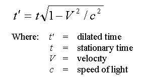

# Time dilation calculator
Simple calculator for calculating age differences (time dilation) between a person on earth versus a person moving in space, based on the "twin paradox".

Used for Illustreret Videnskab @ Bonnier Publications

## Ressources
---
### Based on formular

### Time dilation explained
http://www.emc2-explained.info/Time-Dilation/#.Vfcbs52qpHx

### "The twin paradox"
https://en.wikipedia.org/wiki/Twin_paradox
